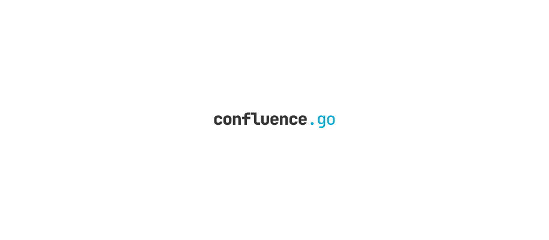

> [!IMPORTANT]
> ### Project Sunset Notice 🌇
>
> ***This project is no longer actively maintained.***
>
> After careful consideration, we’ve decided to sunset development and support for this repository. While it has been a valuable effort, we are no longer able to dedicate the time and resources required to maintain it at the level we consider responsible.
>
> #### Forking and continuation
>
> If you are interested in taking over maintenance or building upon this project, you are encouraged to fork it.
>
> #### Thank you
>
> We sincerely appreciate everyone who contributed, reported issues, or used this project. Your support made it worthwhile.
> </details>

----

<p align="center"><a href="#readme"></a></p>

<p align="center">
  <a href="https://kaos.sh/g/go-confluence.v6"></a>
  <a href="https://kaos.sh/r/go-confluence"></a>
  <a href="https://kaos.sh/w/go-confluence/ci"></a>
  <a href="https://kaos.sh/w/go-confluence/codeql"></a>
  <a href="#license"></a>
</p>

<p align="center"><a href="#usage-example">Usage example</a> • <a href="#ci-status">CI Status</a> • <a href="#license">License</a></p>

<br/>

`go-confluence` is a Go package for working with [Confluence REST API](https://docs.atlassian.com/ConfluenceServer/rest/7.3.3/).

> [!IMPORTANT]
> **Please note that this package only supports retrieving data from the Confluence API (_i.e. you cannot create or modify data with this package_).**

### Usage example

Authentication with username and password.

```go
package main

import (
  "fmt"
  cf "github.com/essentialkaos/go-confluence/v6"
)

func main() {
  api, err := cf.NewAPI("https://confluence.domain.com", cf.AuthBasic{"john", "MySuppaPAssWOrd"})

  api.SetUserAgent("MyApp", "1.2.3")

  if err != nil {
    fmt.Printf("Error: %v\n", err)
    return
  }

  content, err := api.GetContentByID(
    "18173522", cf.ContentIDParameters{
      Version: 4,
      Expand:  []string{"space", "body.view", "version"},
    },
  )

  if err != nil {
    fmt.Printf("Error: %v\n", err)
    return
  }

  fmt.Printf("ID: %s\n", content.ID)
}
```

Authentication with personal token. Please make sure your confluence 7.9 version and later. See [Using Personal Access Tokens guide](https://confluence.atlassian.com/enterprise/using-personal-access-tokens-1026032365.html)

```go
package main

import (
  "fmt"

  cf "github.com/essentialkaos/go-confluence/v6"
)

func main() {
  api, err := cf.NewAPI("https://confluence.domain.com", cf.AuthToken{"avaMTxxxqKaxpFHpmwHPXhjmUFfAJMaU3VXUji73EFhf"})

  api.SetUserAgent("MyApp", "1.2.3")

  if err != nil {
    fmt.Printf("Error: %v\n", err)
    return
  }

  content, err := api.GetContentByID(
    "18173522", cf.ContentIDParameters{
      Version: 4,
      Expand:  []string{"space", "body.view", "version"},
    },
  )
  if err != nil {
    fmt.Printf("Error: %v\n", err)
    return
  }

  fmt.Printf("ID: %s\n", content.ID)
}
```

### CI Status

| Branch     | Status |
|------------|--------|
| `master` (_Stable_) | [](https://kaos.sh/w/go-confluence/ci?query=branch:master) |
| `develop` (_Unstable_) | [](https://kaos.sh/w/go-confluence/ci?query=branch:develop) |

### Contributing

Before contributing to this project please read our [Contributing Guidelines](https://github.com/essentialkaos/.github/blob/master/CONTRIBUTING.md).

### License

[Apache License, Version 2.0](http://www.apache.org/licenses/LICENSE-2.0)

<p align="center"><a href="https://kaos.dev"></a></p>
